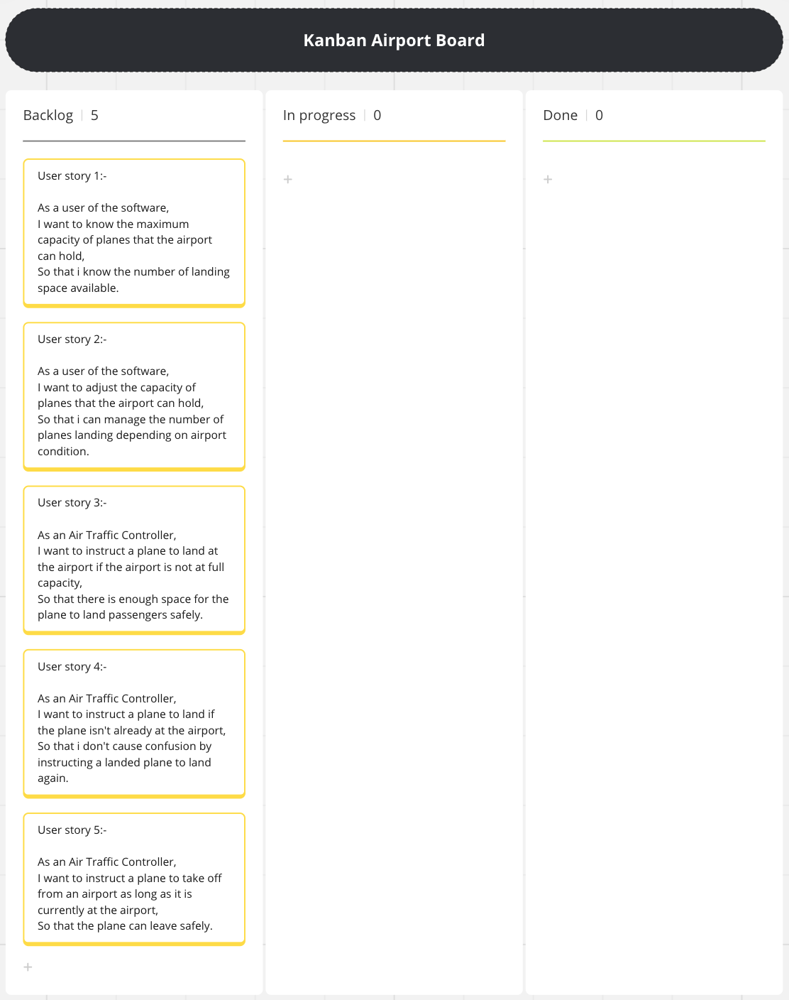
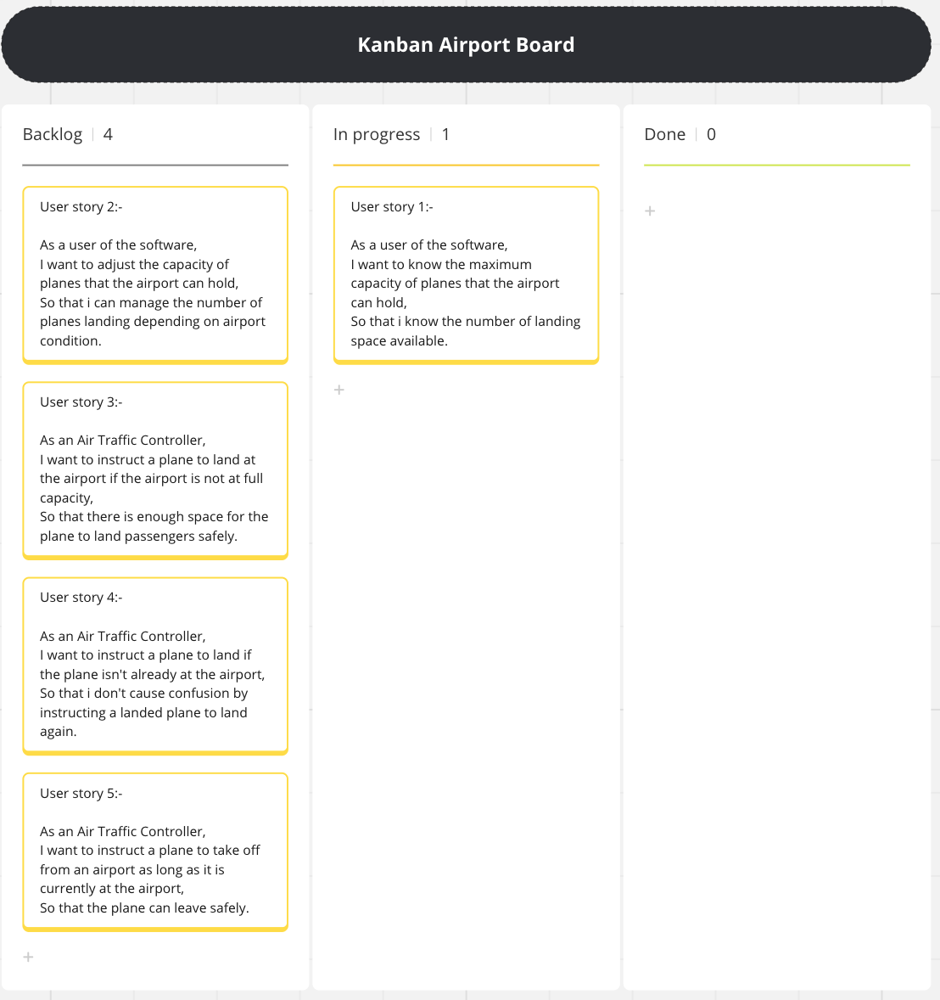
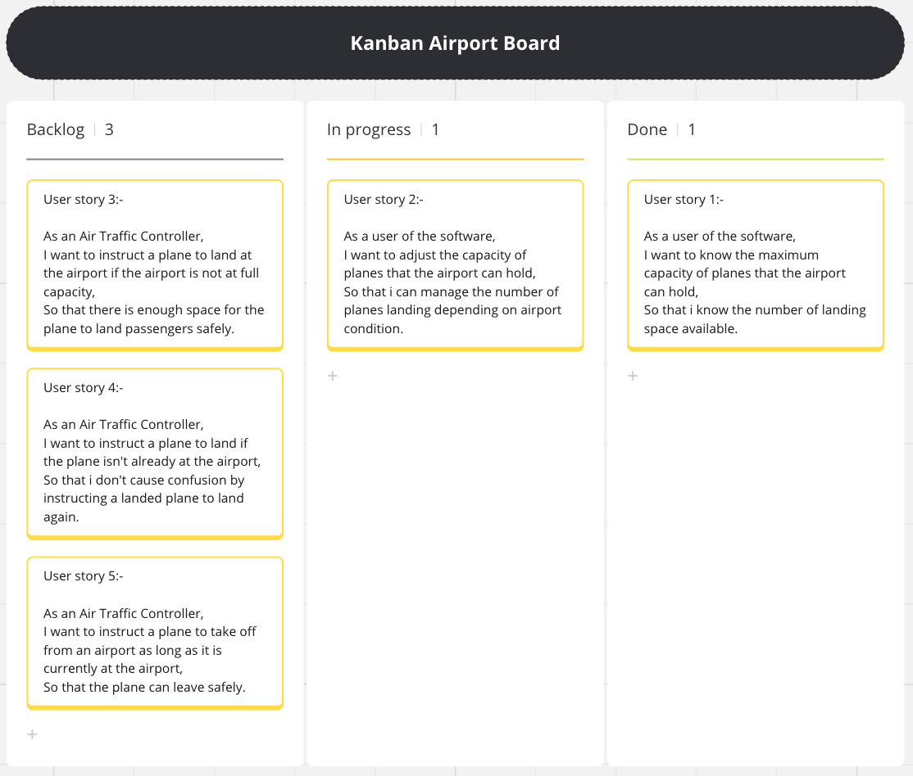
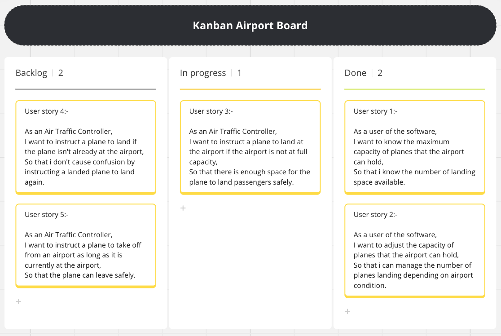
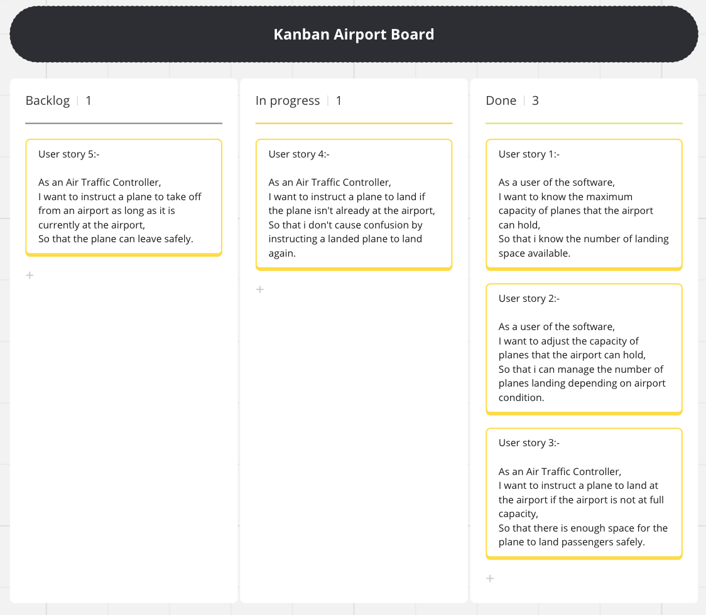
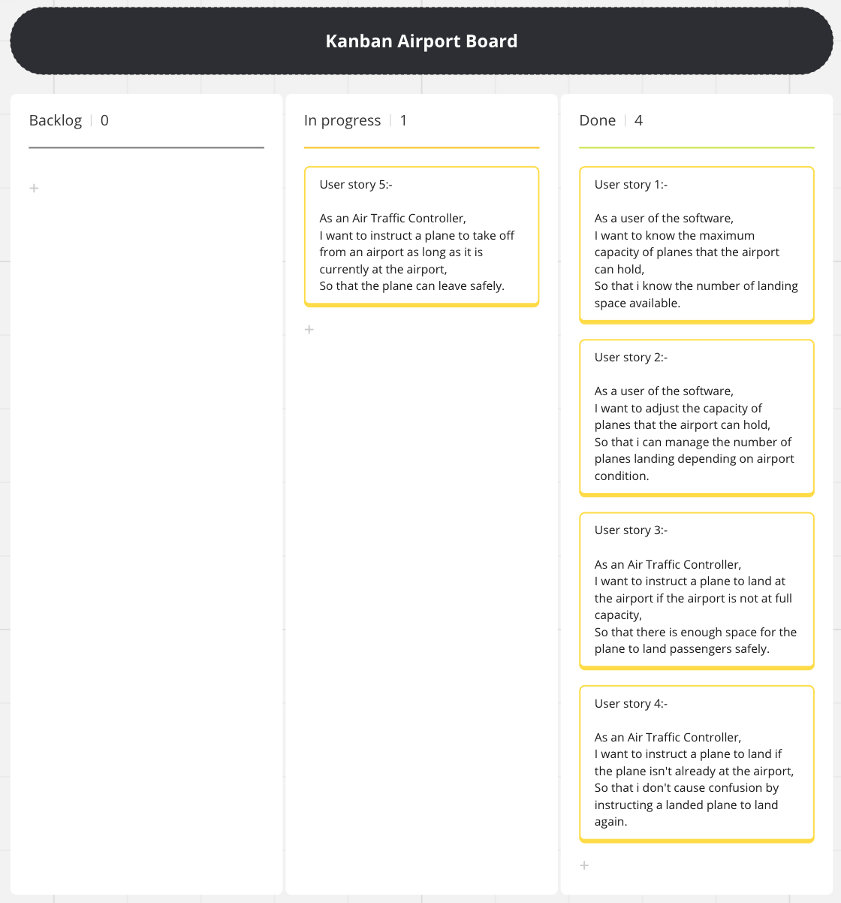
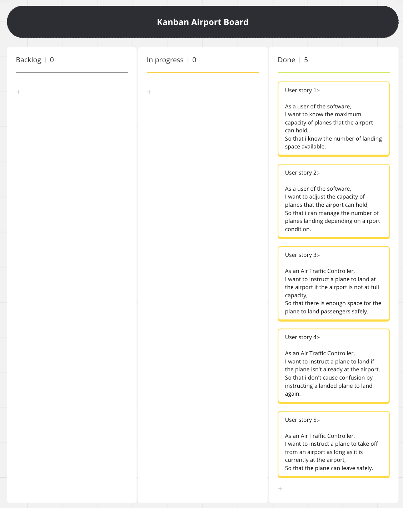

# Domain Models and Test Plan

## Task 1

### Introduction
Airports serves as gateways for millions of travelers and cargo shipments worldwide. To ensure the seamless movement of planes within and around airports, efficient air traffic management systems are needed. From guiding planes during takeoff and landing to managing flight paths and managing overcrowded airport, air traffic management plays a huge role in maintaining safety and efficiency. In this introduction, we delve into the problems, benefits and risk aspects of airports and air traffic management.

### Problems 
- Inefficient traffic management at airports
- Possibility of traffic jams leading to delays and safety hazards
- Lack of reliable data on plane flow
- Risk of accidents due to overcrowding and exceeding maximum capacity
- Difficulty managing urgent situations without the ability to adjust maximum capacity
- Negative impact on passenger experience due to delays and safety concerns

### Benefits 
- Improved efficiency and safety in air traffic management
- Reduction in traffic jams, delays, and safety hazards
- Provision of reliable data on plane flow for air traffic controllers
- Prevention of traffic jams and reduction in delays by directing planes away from full airports
- Flexibility to adjust maximum capacity for better management of urgent situations
- Enhancement of passenger experience with smoother landings and takeoffs due to reliable airport operations

### Problems and Benefits 
 The Software is solving the problems of inefficient traffic management at an airport. Without this software, airports may experience traffic jams, leading to delays and even safety hazards or accidents. The software solves this by allowing air traffic controllers to direct planes to land or take off depending on airport condition such as landing space. The software will give a reliable data on the flow of planes instilling confidence into the air traffic controllers. This improves the overall efficiency and safety because it limits the number of plane landings when the airport slowly reaches maximum capacity which reduces the risk of accidents. If the airport is full, planes are not directed to land, thereby preventing traffic jams, reducing delays and improving safety. The software will be able to change its maximum capacity at the airport meaning it will be much easier to manage urgent situations. Additionally, the passengers experience will improve due to smooth landings and takeoffs managed with reliable airport operations.

### Risks
One significant risk associated with the software is the potential over-reliance of air traffic controllers on its functionality. This could have serious consequences, particularly if the software encounters downtime. In such instances, the lack of support may lead to confusion and miscommunication between air traffic controllers and pilots, potentially resulting in delays or even accidents. Moreover, another drawback of the software is its inability to access flight times. The software cannot verify whether incoming planes are scheduled arrivals, increasing the likelihood of mistakenly directing planes to land.

---
## Task 2 and Task 3

### User Stories and Domain Models

#### User story 1:-
As a user of the software,  
I want to know the maximum capacity of planes that the airport can hold,  
So that i know the number of landing space available.  

| Object  |   Properties    |     Messages     | Output |
| :-----: | :-------------: | :--------------: | :----: |
| Airport | maxCapacity@int | getMaxCapacity() |  @Int  |

#### User story 2:-
As a user of the software,  
I want to adjust the capacity of planes that the airport can hold,  
So that i can manage the number of planes landing depending on airport condition.  

| Object  |   Properties    |       Messages       | Output  |
| :-----: | :-------------: | :------------------: | :-----: |
| Airport | maxCapacity@int | setMaxCapacity(@int) | @String |

#### User story 3:-
As an Air Traffic Controller,  
I want to instruct a plane to land at the airport if the airport is not at full capacity,  
So that there is enough space for the plane to land passengers safely.  

| Object  |        Properties         |     Messages      |  Output  |
| :-----: | :-----------------------: | :---------------: | :------: |
| Airport |      maxCapacity@int      |  capacityFull()   | @Boolean |
|         | planeArray @array[@Plane] | landPlane(@Plane) | @String  |
|  Plane  |        idPlane@int        |   getIdPlane()    |  @Void   |

#### User story 4:-
As an Air Traffic Controller,  
I want to instruct a plane to land if the plane isn't already at the airport,  
So that i don't cause confusion by instructing a landed plane to land again.  

| Object  |        Properties         |     Messages      | Output  |
| :-----: | :-----------------------: | :---------------: | :-----: |
| Airport | planeArray @array[@Plane] | landPlane(@Plane) | @String |
|  Plane  |        idPlane@int        |   getIdPlane()    |  @Void  |

#### User story 5:-
As an Air Traffic Controller,  
I want to instruct a plane to take off from an airport as long as it is currently at the airport,  
So that the plane can leave safely.  

| Object  |        Properties         |       Messages       | Output  |
| :-----: | :-----------------------: | :------------------: | :-----: |
| Airport | planeArray @array[@Plane] | planeTakeOff(@Plane) | @String |
|  Plane  |        idPlane@int        |     getIdPlane()     |  @Void  |

### Additional Features

#### User story 6:-
As an Air Traffic Controller,  
I want to prevent planes from landing at the airport during stormy weather conditions,  
So the aircraft and passengers are safe, minimizing the risk of accidents during landing.  

| Object  |        Properties         |      Messages       |  Output  |
| :-----: | :-----------------------: | :-----------------: | :------: |
| Airport | planeArray @array[@Plane] |  landPlane(@Plane)  | @String  |
|         |     stormy(@boolean)      | setStormy(@boolean) | @boolean |
|  Plane  |        idPlane@int        |    getIdPlane()     |  @Void   |

#### User story 7:-
As an Air Traffic Controller,  
I want to ensure that planes cannot take-off from the airport when the weather conditions are stormy,  
So the aircraft and passengers can reach their destination safely, minimizing the risk of accidents during the flight.  

| Object  |        Properties         |       Messages       |  Output  |
| :-----: | :-----------------------: | :------------------: | :------: |
| Airport | planeArray @array[@Plane] | planeTakeOff(@Plane) | @String  |
|         |     stormy(@boolean)      | setStormy(@boolean)  | @boolean |
|  Plane  |        idPlane@int        |     getIdPlane()     |  @Void   |

### Kanban Board

link to kanban board:-
https://miro.com/app/board/uXjVKQaiFG8=/